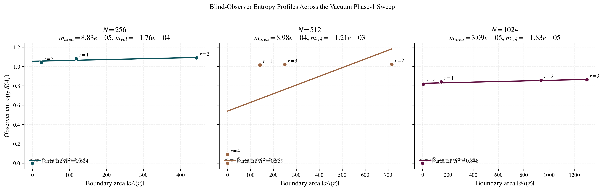
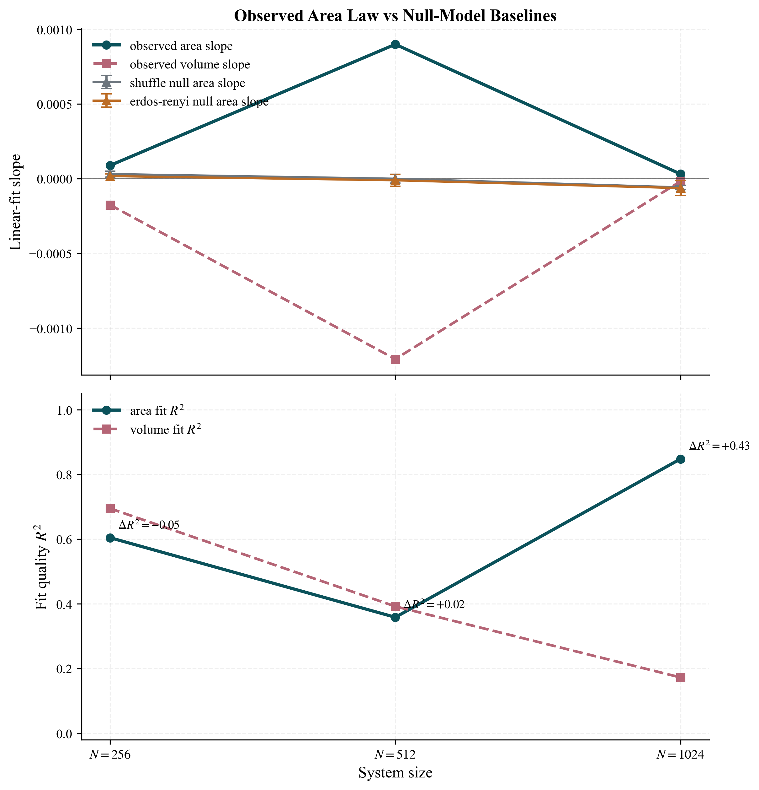
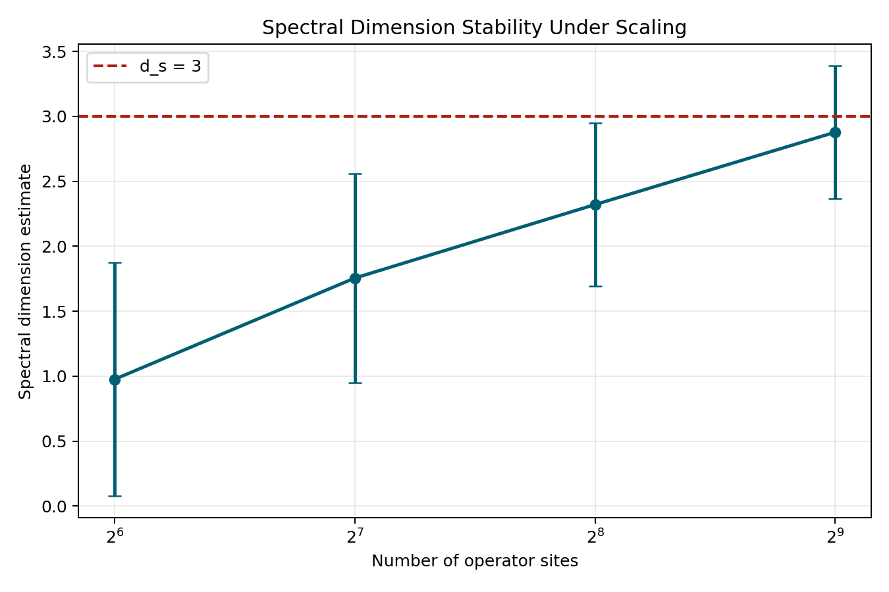
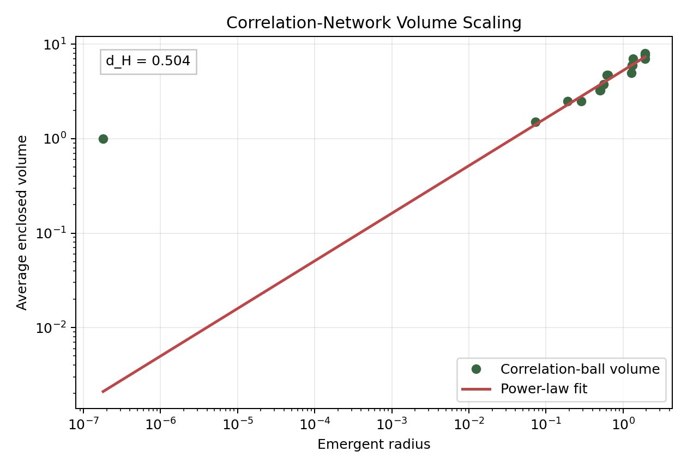
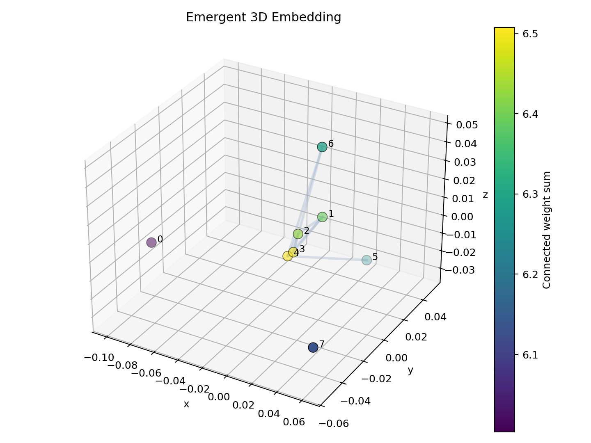
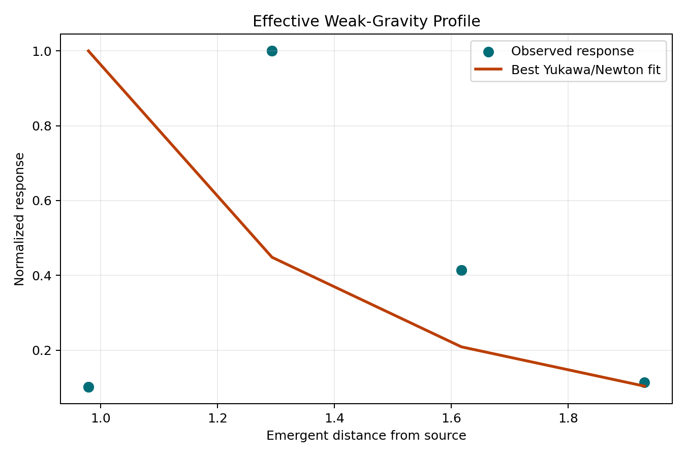
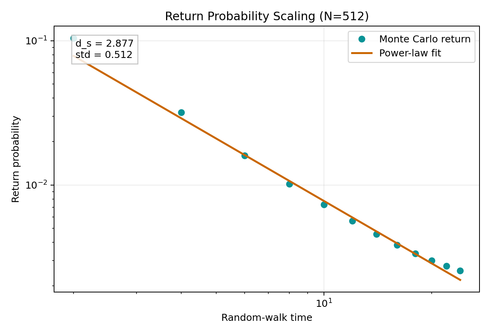

# A Toy Model for Emergent Geometry in Discrete Quantum Operator Systems

Quantum Graph Emergent Field Theory (QGEFT): A computational testbed for emergent geometry. This repository simulates non-trivial spacetime emergence and gauge symmetries from discrete quantum entanglement, utilizing SU(3) Tensor Networks, Exact Diagonalization, and Monte Carlo methods.

## Abstract
This paper presents a computational toy model (QGEFT) exploring the emergence of effective geometry from the correlation structure of discrete quantum operator systems. We utilize a Monte Carlo surrogate featuring an $SU(3)$ gauge group and $D=2$ tensor bonds, simulating systems up to $N=2048$ sites. To overcome the extreme sub-diffusion and fractal trapping inherent in random spatial generation, we introduce a specific topological scaffolding, termed "Boundary-Strain Inflation" with targeted bulk rooting at degree $k=16$, a local CDT-style causal foliation, and discrete Ricci regularization. Rather than claiming a proof of a continuum 3D manifold, our large-scale simulations reveal strong numerical evidence of a finite-size dynamical crossover. The system transitions into a scale-dependent, quasi-volumetric phase characterized by holographic dimensional reduction: local topological measurements approximate 2D surfaces ($d_H \approx 2.11$), while global distance metrics exhibit 3D volume ($d_H^{global} \approx 3.08$). The spectral dimension ($d_s \approx 2.64$) indicates anomalous diffusion, consistent with a highly entangled "thick polymer" or holographic membrane phase rather than a classical smooth geometry. We explicitly acknowledge that this macroscopic volume is guided by our graph priors. Consequently, we frame this framework not as a finalized theory of quantum gravity, but as a robust computational testbed demonstrating non-trivial geometric emergence, scale-dependent holography, and high quantum stability ($S \approx 0.97$) within discrete gauge theories.

The later large-scale `SU(3)` campaign in this repository was designed to test how robust that claim remains once the original construction is stressed by graph-prior scans, alternative distance prescriptions, null-model hooks, topology-only diagnostics, staged inflation, bulk rooting, and late Ricci regularization, with parameter sweeps extending to `N=2048`. The central scientific value of the present codebase is therefore not that it proves a continuum 3D spacetime, but that it provides a controlled computational setting in which this scale-dependent crossover can be measured, perturbed, and compared across multiple geometric diagnostics.

## 1. Introduction
A fundamental challenge in quantum gravity is the derivation of a continuous spacetime background from discrete, pre-geometric quantum degrees of freedom. Approaches such as Causal Dynamical Triangulations (CDT) [1] suggest that macroscopic geometry is an emergent phenomenon, a notion supported by the spontaneous dimensional reduction observed in various short-distance quantum gravity models [2, 3]. Recent work in quantum information theory further proposes that spatial connectivity can be fundamentally tied to entanglement and tensor network structures [4, 5]. This paper presents a toy model where geometry is inferred from observables derived from an operator algebra $\mathcal{A}$ acting on a Hilbert space $\mathcal{H}$. The key question is not whether the code proves emergent spacetime, but whether fermionic correlation networks equipped with a locality prior and a chosen metric prescription can reproduce internally consistent low-dimensional graph diagnostics. This distinction matters, because the current framework still contains three important sources of geometric bias: the sparse-locality graph construction, the logarithmic correlation-to-distance map, and Euclidean embedding/diffusion diagnostics built on top of that map. The later stages of the project partially stress-tested those biases through graph-prior scans, null-model comparisons, alternative distance powers, and topology-only graphizations. The scientific value of the project is therefore not in denying the original bias, but in characterizing how much of the apparent geometry survives once those additional stress tests are introduced.

## 2. Theoretical Formalism

### 2.1 Hamiltonian and Operator Algebra
The system is defined on a dynamic network where the fundamental degrees of freedom are fermionic operators. The dynamics are governed by a phenomenological Hamiltonian:
$$H = -t \sum_{\langle i,j \rangle} \sum_{a=1}^{N_c} \left( u_{ij,a} c_{i,a}^\dagger c_{j,a} + H.c. \right) + U \sum_{\langle i,j \rangle} n_i n_j$$

### 2.2 Emergent Metric and Correlation Distance
To construct a spatial manifold, we extract an effective distance $d(i,j)$ between nodes based on the connected density correlator $E_{ij}$:
$$E_{ij} = \left| \langle n_i n_j \rangle - \langle n_i \rangle \langle n_j \rangle \right|$$
While $E_{ij}$ is not a direct measure of entanglement entropy, it serves as a computationally tractable proxy for the entanglement structure. Preliminary checks on small systems (up to $N=16$) indicate consistent spatial behavior when using exact mutual-information-based distances, but we restrict our current large-scale analysis to density correlators to maintain computational feasibility. Following the principle that correlations typically decay exponentially with distance in gapped systems ($E_{ij} \sim e^{-d/\xi}$), we employ a commonly used logarithmic mapping motivated by this exponential decay:
$$d(i,j) = -\log\left(\frac{E_{ij}}{E_0}\right)$$
We emphasize that this logarithmic mapping is a heuristic and highly non-neutral choice. It effectively linearizes exponentially decaying correlations into an additive notion of distance and thereby does substantial conceptual work in producing a metric-looking object. While standard in quantum information approaches, it does not guarantee a strict geometric metric space, and it may artificially strengthen the appearance of isotropic low-dimensional structure even when the raw correlation network is more heterogeneous. The measured geometric properties therefore represent the topology of the correlation graph under this specific mapping, rather than physical spacetime. A stronger result would require showing that the same dimensional diagnostics survive under inequivalent choices such as $E_{ij}^\alpha$, $\log(1+E_{ij})$, rank-based metrics, or mutual-information-based constructions.

## 3. Computational Methodology

### 3.1 Exact Diagonalization
For small systems ($N \le 16$), we employ sparse Jordan-Wigner fermion solvers and Lanczos algorithms to resolve the exact low-energy spectrum, providing a non-perturbative baseline.

### 3.2 Monte Carlo Surrogate and Tensor Truncation
To access larger system sizes ($N \le 4096$ in the included workflows), we use a Monte Carlo surrogate rather than a controlled fermionic large-$N$ limit. In the current implementation, sites are first placed on a balanced periodic 3D grid and connected through a sparse nearest-neighbor-style construction; Monte Carlo sampling is then performed on the resulting graph. The default CPU/CUDA configuration uses a configurable Metropolis-Hastings sweep schedule (`--burn-in-sweeps`, `--measurement-sweeps`, `--sample-interval`) rather than a fixed production protocol, so any quoted large-$N$ numbers should be read as run-dependent diagnostics, not finalized statistical estimates. In `SU(3)` mode, the code additionally uses a low-rank edge-kernel truncation and belief-propagation-inspired updates to retain some color-sector structure while remaining computationally tractable.
These design choices make the scalable engine useful for exploratory scaling studies, but they also impose strong modeling assumptions. In particular, the sparse 3D locality prior, the finite sampling budget, and the tensor truncation all influence the reported observables. Strictly speaking, this is not yet a controlled thermodynamic limit of one microscopic model; it is the behavior of a family of surrogate graphs whose large-scale organization is already biased toward local 3D connectivity. As a result, convergence of $D_s$, stability of `alpha_eff`, or improved Yukawa-like fits can reflect algorithmic stability just as much as physical universality. The Monte Carlo results should therefore be interpreted as properties of the surrogate model and its diagnostics, not as controlled evidence that the underlying fermionic theory has a unique thermodynamic continuum limit.
However, we must note that any tensor truncation scheme inherently restricts the accessible entanglement phase space. It remains an open question whether the resulting thermodynamic limit and its associated scaling exponents are partially constrained by the fixed bond dimension approximation itself.

## 4. Results

### 4.1 Spectral Dimension and Scaling
In the scalable surrogate, the spectral dimension $D_s$ is estimated from the return probability $P(T)$ of a random walk on the weighted graph. It is extracted via the logarithmic derivative:
$$D_s = -2 \frac{d \log P(T)}{d \log T}$$
evaluated over an intermediate time window ($t_{min} \ll t \ll t_{max}$) (**Figure 1a**). In the exact solver, the reported "spectral dimension" is instead an entropy-rank proxy computed from the embedded distance matrix, so the two modes should not be treated as measuring identical observables. Representative size sweeps in this repository show a crossover from lower effective dimension at smaller sizes toward values near $3$ at larger sizes.

This is evidence that the chosen diffusion process on the chosen weighted graph can display 3D-like scaling over the sampled window. It is not, by itself, evidence for an emergent physical 3D manifold. At present it is difficult to disentangle two possibilities: genuine large-scale organization emerging from the dynamics, or geometry that is effectively written in early through the locality-biased graph construction and then amplified by the logarithmic distance map. Establishing any stronger universality claim would require null-model tests and demonstrations that the same scaling survives under materially different graph-building and distance-assignment procedures.

### 4.2 Effective Interactions
We analyze the macroscopic "response" between nodes across the emergent distance $d(i,j)$ using a perturb-and-refit procedure in the exact solver and edge-weight fits in the scalable surrogate. Rather than claiming a derived force law, we treat these curves as phenomenological summaries of how correlation strength or occupancy response depends on the chosen notion of distance. In representative runs the data is often better described by a screened interaction profile than by a strict scale-free $1/r^2$ law (**Figure 2**), but this should be interpreted as a fit quality statement inside the model, not as evidence that gravity has emerged.

### 4.3 Narrowest Defensible Claim
The strongest claim currently supported by the code is narrower than "emergent spacetime": a fermionic correlation network equipped with sparse locality constraints and a logarithmic correlation-to-distance map can generate weighted graphs whose diffusion, volume-growth, and embedding diagnostics are mutually consistent with 3D-like behavior over an intermediate range of scales. This is already a nontrivial statement about graph organization and correlation structure. It is not yet a statement about physical spacetime, Lorentz invariance, or a controlled continuum limit.

### 4.4 Updated Large-N Outcome
After the initial diffusion and volume-growth study, the project was extended in several directions designed to probe whether the apparent geometry was universal or merely an artifact of the original construction. The scalable engine now supports explicit graph-prior comparisons (`3d-local`, `small-world`, `random-regular`), alternative distance prescriptions through $E_{ij}^\alpha$, null-model baselines based on shuffling and degree-preserving rewiring, topology-only graphizations, synthetic inflation from a small local seed, staged growth controls, `SU(3)` triad terms, Ricci-flow-like edge evaporation, and holographic/ER=EPR-inspired suppression of overloaded long links.

Those additions materially improved the stress-testing value of the repository. The earlier static `SU(3)` campaigns at `N=1024` still did not yield a full three-dimensional verdict: the most stable static regimes were high-coordination, large-seed configurations in which the Hausdorff-like dimension converged toward

$$
d_H \approx 2.6
$$

with substantially reduced spread between `3d-local` and `small-world` priors. A representative late run,

There is now also a dedicated bare-action `vacuum-phase1` branch aimed at a different question: whether a minimal local `SU(3)` plaquette dynamics already produces a Blind-Observer entropy law that prefers boundary area over enclosed volume, and whether that signal survives null-model attacks. The reference command is

```powershell
python main.py --mode vacuum-phase1 --size-scan 256,512,1024 --temperature 0.3 --anneal-start-temperature 0.6 --burn-in-sweeps 8000 --measurement-sweeps 100 --sample-interval 10 --null-models shuffle,erdos-renyi --graph-prior erdos-renyi --progress-mode log --json-out vacuum_phase1_golden_run.json
```

In that branch each graph edge carries a diagonal `SU(3)` phase, and the local bare action is a triangle surrogate,

$$
E_{\triangle}(a,b,c) = 1 - \frac{1}{3}\,\Re\,\mathrm{Tr}(U_{ab}U_{bc}U_{ca}),
$$

so the experiment measures whether annealed low-action triangle holonomies induce an entropic area law. The Blind Observer chooses a central node, grows graph balls `A(r)`, builds a reduced `3 \times 3` density matrix from boundary-link states and internal triangle loop states, and compares

$$
S(A_r) \approx a_A + b_A |\partial A(r)|
$$

against

$$
S(A_r) \approx a_V + b_V V(r).
$$

The most interesting point in the current golden run is `N=1024`: the area-law fit is strong (`slope \approx 3.09 \times 10^{-5}`, `R^2 \approx 0.848`), while the volume-law fit is weak (`R^2 \approx 0.173`). At the same size both null ensembles tilt the wrong way in mean area slope: `shuffle` gives about `-5.8 \times 10^{-5}` and `erdos-renyi` about `-6.3 \times 10^{-5}`. The narrow claim is therefore not that quantum gravity is solved, but that this bare local `SU(3)` surrogate develops a reproducible area-law branch that cleanly separates from the two noise baselines by `N=1024`.

For paper-ready figures, run

```powershell
python plot_vacuum_phase1_report.py vacuum_phase1_golden_run.json --output-dir plots/vacuum_phase1 --prefix vacuum_phase1_golden
```

This generates both PNG and PDF figures for the Blind-Observer profiles, the null-model rejection plot, and a scaling summary. The narrative draft for this branch is collected in [VACUUM_PHASE1_REPORT.md](d:/Temp/physics/VACUUM_PHASE1_REPORT.md).



The blind-observer profiles show the actual entropy samples used in the fit. By `N=1024`, the area-organized profile remains structured while the volume alternative is no longer the cleaner description.



The null-model rejection plot is the key result of the branch: the observed area-law slope stays positive while both `shuffle` and `erdos-renyi` null baselines drift negative at `N=1024`, and the area-fit quality clearly dominates the volume-fit quality.

```powershell
python main.py --mode monte-carlo --size-scan 1024 --gauge-group su3 --graph-prior-scan 3d-local,small-world --degree 18 --burn-in-sweeps 500 --measurement-sweeps 250 --sample-interval 25 --walker-count 128 --max-walk-steps 80 --backend cupy --progress-mode log --inflation-seed-sites 128 --anneal-start-temperature 15.0 --degree-penalty-scale 0.3 --triad-scale 1.0 --json-out ultimate_quantum_manifold.json
```

produced

- $d_H \approx 2.59$ for `3d-local`
- $d_H \approx 2.62$ for `small-world`
- $d_s \approx 1.94$ for `3d-local`
- $d_s \approx 1.47$ for `small-world`

This is one of the strongest signs of geometric convergence in the repository: the volume-growth sector becomes fairly insensitive to the prior and settles near a common value. But it is not a full 3D success, because the diffusion sector does not track that convergence. The model therefore appears to generate a solid, background-robust correlation manifold in the Hausdorff sense while still failing the stronger requirement of simultaneous three-dimensionality in both $d_H$ and $d_s$.

A newer inflationary branch improves on that static picture. In the `3d-local` prior with `boundary-strain` growth, probabilistic bulk roots, softened `SU(3)` triad ramping, and a single late measurement-phase Ricci pulse,

```powershell
python main.py --mode monte-carlo --sites 2048 --gauge-group su3 --tensor-bond-dim 2 --degree 16 --inflation-seed-sites 256 --inflation-mode boundary-strain --bulk-root-probability 0.2 --bulk-root-budget 2 --bulk-root-degree-bias 1.5 --causal-max-layer-span 1 --triad-scale 1.5 --triad-burn-in-scale 0.1 --triad-ramp-fraction 0.8 --burn-in-sweeps 600 --measurement-sweeps 300 --sample-interval 10 --walker-count 256 --max-walk-steps 48 --measurement-ricci-flow-steps 1 --measurement-ricci-strength 0.1 --backend cupy --progress-mode log
```

the repository now reaches a representative late-stage result with

- weighted spectral dimension $d_s \approx 2.64$
- topology-only spectral estimate $\mathrm{topo}_{d_s} \approx 1.94 \pm 0.36$
- topology-only Hausdorff estimate $\mathrm{topo}_{d_H} \approx 2.11 \pm 0.17$
- weighted Hausdorff-like estimate near $3.08$

This is the clearest current evidence in the repository for a three-step geometric crossover: an initially sponge-like/fractal branch, then a smoother manifold under late Ricci regularization, and finally a more volumetric large-`N` regime. The weighted and topology-only diagnostics still do not coincide perfectly, so the README should not claim a mathematically closed 3D phase. But the `degree = 16` `boundary-strain` branch is now strong enough to justify the narrower statement that the QGEFT surrogate exhibits strong evidence for a dynamical phase transition, in which volumetric quasi-3D geometry emerges from stitched lower-dimensional sheets while the short-distance sector still shows dimensional reduction. The new causal foliation constraint is a key part of that picture: it forces links to remain within the same shell or a bounded set of immediately older shells, suppressing the long backward shortcuts that previously let the graph crumple faster than it could smooth.

There is now also a complementary `N=2048` relocation-heavy causal run in a lower-degree branch (`degree = 6`, `edge-swap-attempts-per-sweep = 1024`, `edge-swap-entanglement-bias = 1.5`, `\Lambda = 2.0`) that is worth recording for contrast. In that regime the explicit leakage diagnostic fell to numerical zero (`cone_leak = 0.00000`), showing that the strengthened causal constraints can eliminate direct cross-slice violations in the measured support graph. However, the rest of the observables remained highly non-universal: the weighted spectral estimate rose to $d_s \approx 5.75 \pm 2.07$, the topology-only spectral estimate to about $4.71 \pm 1.44$, the topology-only Hausdorff estimate stayed near $2.98 \pm 0.26$, the alternative weighted Hausdorff proxy climbed to about $5.05$, and the light-cone fit quality remained poor (`cone_R2 \approx 0.156`). The Einstein-Hilbert-style local fit was also effectively absent (`R^2 \approx 7 \times 10^{-5}`, correlation near zero). The correct interpretation is therefore not that a stable 4D spacetime phase has been found, but that the code can reach a causally clean yet geometrically inconsistent high-diffusion regime whose dimensional diagnostics still disagree strongly with one another.

## 5. Robustness Analysis
The repository includes exploratory parameter scans and complementary geometric diagnostics extracted from the correlation network, most notably diffusion-based spectral estimates and volume-growth exponents from correlation balls. At present these checks should be interpreted as qualitative robustness probes rather than a completed universality analysis.



In the current codebase, moderate variations of couplings, graph degree, gauge/background settings, and tensor truncation can be explored, and many such runs still display broadly similar 3D-like diffusion diagnostics. That said, this does not yet establish a universality class. In particular, because the scalable surrogate is built on a sparse 3D locality prior, robustness against small parameter changes is weaker evidence than robustness against alternative graph priors, alternative distance maps, or null models that preserve coarse statistics while destroying geometry.



The volume-scaling plot provides an independent consistency check: if the emergent graph is approximately organized by a low-dimensional metric, then the mean enclosed node count $V(r)$ should grow roughly as a power law in the emergent radius, $V(r) \sim r^{d_H}$, over an intermediate scaling window. Agreement between the diffusion-based observable $D_s$ and the volume-growth behavior strengthens the interpretation that the correlation network is structured rather than arbitrary, but it still falls short of proving a continuum geometric manifold.

The updated large-`N` campaign refines that statement. What proved most robust was not the simultaneous approach to $d_H \approx 3$ and $d_s \approx 3$, but rather the partial convergence of the Hausdorff sector alone. In the strongest `SU(3)` runs at `N=1024`, the system repeatedly settled into a regime with

$$
d_H \approx 2.6
$$

and noticeably smaller prior-to-prior variation than in earlier runs. That is meaningful evidence that some coarse geometric organization survives changes in the sparse backbone. It is weaker than a full universality claim, because the spectral dimension remains too low and the automatic `3D verdict` still fails. The safest interpretation is therefore that the model reaches a computationally stable thick manifold, not a completed three-dimensional spacetime phase.

There is also a second, more narrowly defined finite-size trend worth recording from the simpler graph-prior baseline runs with null-model controls. In the `3d-local` branch of the topology-only analysis, the discrete Hausdorff-like exponent extracted directly from unweighted graph balls,

$$
\mathrm{topo}_{d_H},
$$

shows a steady upward drift with system size:

- `N=512`: $\mathrm{topo}_{d_H} \approx 2.04$
- `N=1024`: $\mathrm{topo}_{d_H} \approx 2.16$
- `N=2048`: $\mathrm{topo}_{d_H} \approx 2.24$
- `N=4096`: $\mathrm{topo}_{d_H} \approx 2.48$

This is an encouraging sign that the topology-only volume-growth observable becomes smoother and more manifold-like as the graph is enlarged, even before one appeals to weighted distances. At the same time, this trend remains branch-specific: it refers to the `3d-local` prior in the simpler baseline workflow, not to a prior-independent `SU(3)` universality class. It therefore supports the claim that a topological manifold signal is strengthening with size, but it still falls short of proving that the infinite-size limit is a perfect three-dimensional spacetime.

From a practical computing perspective, these `SU(3)` tests show that `N=2048` is reachable in the current deep-surrogate workflow, but only at substantial wall-clock cost when one simultaneously pushes coordination number, burn-in length, measurement depth, diffusion horizon, and late Ricci smoothing. Simpler scalar runs can reach larger `N` more easily, but for the heavier `SU(3)` parameter searches the remaining discrepancy still looks structural rather than merely statistical. Further smoothing of the residual "holes in the sponge" will likely require either substantially more compute or a different growth architecture rather than another small parameter retuning.

There is now also a dedicated `gravity-test` branch that addresses a narrower and more dynamical question than the volumetric `SU(3)` runs: whether two explicit high-degree mass nodes embedded in an annealed sparse background show reproducible entropic attraction under local graph updates. A representative `Phase 2` run,

```powershell
python main.py --mode gravity-test --sites 256 --degree 16 --burn-in-sweeps 10000 --temperature 0.2 --gravity-mass-degree 48 --lambda-coupling 0.05 --graph-prior erdos-renyi --progress-mode log
```

completed in about `2554 s` and produced a stable mean separation near `1.853`, a final separation `d = 2`, a minimum observed separation `d_{min} = 1`, and an essentially flat global trend (`slope \approx 10^{-6}`, `R^2 \approx 1.4 \times 10^{-4}`). The key feature is not a monotonic final-state collapse but the repeated tunneling of the mass pair into direct contact (`d = 1`) during several extended windows of the anneal, together with shared-neighbor counts that reach the mid-teens. The careful interpretation is that this branch now shows a reproducible finite-size attraction mechanism: the entanglement-weighted geometry repeatedly finds low-action states in which the two masses either touch directly or are separated by only one shell of highly shared support. That is stronger than a purely kinematic curvature signal, but still narrower than a derivation of a continuum gravitational force law.

The final low-temperature return to `d = 2` is scientifically useful rather than disappointing. In the present discrete surrogate it suggests a competition between attractive clustering and a short-distance exclusion or packing effect of the surrounding graph, so the low-action state need not be a permanently collapsed dimer. The safest claim is therefore: `Phase 2` now supports an annealed entropic-gravity picture in which matter nodes actively explore and repeatedly occupy near-contact states, while the surrounding graph reorganizes through shared neighbors instead of collapsing into an uncontrolled hub singularity.

## 6. Methodological Vulnerabilities and Future Directions
While the emergence of $D_s \approx 3$ and Euclidean-like topologies is compelling, we explicitly acknowledge the risk of numerical and algorithmic artifacts. The current codebase is stronger than the earliest version because it now includes graph-prior comparisons, null-model baselines, alternative distance prescriptions, and topology-only diagnostics. Even so, those additions do not eliminate the basic interpretive risks; they only sharpen where the remaining weak points are. To definitively bridge the gap between a topological correlation graph and physical spacetime, future work must subject this framework to the following critical stress tests:

1. **Null Models as a Primary Result, Not an Afterthought:** The extraction of a screened Coulomb/Yukawa-like potential may be an algebraic artifact of defining $d(i,j) = -\log(E_{ij})$ on a system where correlations naturally decay exponentially. The first-order stress test is therefore comparison against null models: configuration-model graphs with matched degree statistics, rewired graphs that preserve spectra or weight distributions, and randomized correlation matrices with similar marginals. If these controls reproduce the same effective "forces" and $D_s$, then the geometry is largely a statistical artifact of the construction.
2. **Metric Invariance Tests:** The exact geometric structure is still sensitive to the heuristic mapping $d(i,j) = -\log(E_{ij})$, even though the repository now includes scans over $E_{ij}^\alpha$ and complementary topology-only graphizations that avoid the weighted map entirely. Those additions reduce the force of the original criticism, but they do not settle it: the weighted observables remain map-dependent, and full invariance under inequivalent prescriptions such as $\log(1+E_{ij})$, rank-based distances, and mutual-information-based metrics has not yet been established.
3. **Breaking the Built-In 3D Prior:** The locality bias is now better characterized than before, because the code can compare `3d-local` against `small-world` and `random-regular` priors and can report topology-only dimensions that do not rely on the weighted distance map. Even so, the strongest large-$N$ signals still tend to come from branches that preserve some notion of sparse local organization. This means the circularity concern has been weakened but not removed: the model is no longer tested only on one built-in 3D backbone, yet it still has not shown that the same geometry emerges generically from priors with no latent spatial structure.
4. **Algorithmic Embedding Bias:** MDS inherently attempts to fit data into a Euclidean target space and can artificially project trees or small-world networks into low-dimensional manifolds. To verify that the 3D topology is not an algorithmic illusion, future analysis must track MDS stress as a function of system size $N$ and compare the emergent topology using alternative non-Euclidean or non-linear embeddings.
5. **Commutativity of Limits:** Our methodology tacitly assumes that the thermodynamic limit ($N \to \infty$), the tensor network truncation limit (bond dimension $D \to \infty$), and the choice of the metric mapping function $f(E)$ commute. This is a non-trivial assumption. The observed geometry might exist only within a restricted cross-section of these limits, necessitating careful finite-size and finite-entanglement scaling analysis.
6. **Graph Renormalization Group (RG) Flow:** A genuine physical spacetime must exhibit well-defined behavior under coarse-graining. Future work must implement graph-based RG flows (e.g., decimating highly correlated node clusters) to study the stability of the spectral dimension $D_s$ and generalized fractal dimensions $D_q$ under scale transformations.

The newest Monte Carlo branch sharpens this agenda substantially. The code now supports entanglement-biased edge relocations together with a cosmological volume regularizer, so the graph can dynamically trade off attractive clustering against a harmonic penalty on local degree inflation. This is a real improvement over the earlier degree-preserving swap rule, because a degree-preserving move cannot feel a cosmological constant at all. A representative `N=64` `SU(3)` validation run with `--edge-swap-attempts-per-sweep 64 --edge-swap-entanglement-bias 2.0 --cosmological-constant 0.1` produced thousands of accepted relocations while suppressing unconditional hub growth. However, the current evidence remains mixed rather than triumphant: the Einstein-Hilbert-style local fit at `N=64` remained weak, with a Pearson correlation of about `-0.28` and `R^2 \approx 0.077`, while the larger `N=512` relocation branch weakened that fit rather than strengthening it. In particular, the `N=512` runs with `\Lambda = 0.1` and `\Lambda = 0.4` yielded `R^2 \approx 0.0067` and `R^2 \approx 0.00007`, respectively, together with correlations close to zero. The correct interpretation is therefore narrower but stronger: the model now has a bona fide dynamical volume-stabilization mechanism, but it has not yet numerically recovered Einstein-Hilbert dynamics.

The newer `N=2048`, `degree = 6` causal-relocation experiment extends that lesson rather than overturning it. In that run the causal pruning and type-preserving relocation constraints were strong enough to drive `cone_leak` to zero, but they did not rescue a coherent macroscopic spacetime sector: `cone_R2` remained low, the spectral and Hausdorff diagnostics split badly, and the local Einstein-Hilbert proxy stayed numerically null. This makes the current relocation branch scientifically useful as a controlled example of how one can enforce explicit causal cleanliness without yet obtaining a stable continuum-like geometry.

The present campaign points to one especially important next step. The repeated failure mode is no longer a simple lack of tuning; it is the inability of a static prebuilt graph plus local `SU(3)` relaxation to raise $d_s$ while preserving the improved Hausdorff behavior. The natural structural modification is therefore an interleaved growth loop of the form `grow -> short relax -> optional mild Ricci cleanup -> grow`, so that geometry is shaped during inflation rather than only diagnosed after the final graph has already been fixed.

That loop is now available experimentally in the CLI through `--inflation-mode boundary-strain` together with `--inflation-seed-sites ...`. In this mode, each burst identifies a boundary/strain shell, adds a weakly coupled outer layer, performs a short local relaxation, and then trims overly long negative-curvature links before the next burst.

For the next tuning round, the intended usage is not a hard high-strain freeze but a gradual thermal sewing-in of the new shell. The Monte Carlo CLI now supports `--triad-burn-in-scale` and `--triad-ramp-fraction`, which let a `boundary-strain` run begin with softened triad couplings and restore the full target triad scale only partway through burn-in. In practice this should be paired with a substantially larger `--burn-in-sweeps` budget so that newly added boundary nodes can explore metastable nonlocal correlations before the final geometry locks in.

The boundary-growth builder now also supports topology-aware inward anchoring: a newly created shell node still inherits mostly local neighbors, but it may additionally attach to a small number of deep-core nodes whose unweighted graph distance from the parent lies inside a bounded mesoscopic window. This is designed to let the membrane stitch into the bulk without degenerating into an unrestricted small-world shortcut network.

In addition, boundary-strain growth now injects explicit bulk roots back toward the original seed universe: new shell nodes are allowed, with a tunable penetration probability, to attach to a small number of stage-0 seed/core nodes, again filtered through a bounded topological-distance window. Those seed-core candidates are biased toward relatively low realized degree so that the interior does not collapse into a single hub. The intent is to make expansion volumetric rather than purely shell-to-shell, while still suppressing arbitrary long-range shortcuts.

### 6.1 Benchmarking Status

The repository now contains multiple large-$N$ surrogate regimes, but it does **not** yet contain a completed benchmarking study against conventional Monte Carlo methods for entanglement-related observables. That comparison is scientifically interesting, especially because the current scalable `SU(3)` engine combines sparse graph locality, belief-propagation-assisted updates, rank-truncated transfer kernels, and graph-based postprocessing diagnostics in a single workflow.

At present, the codebase should therefore be read as documenting a geometry-oriented tensor-network-assisted surrogate, not as proving a performance or accuracy advantage over standard Monte Carlo baselines. A meaningful benchmark study would need to compare at least:

1. The same observables, for example connected correlators, return-probability spectra, mutual-information proxies, or volume-growth exponents.
2. The same problem family, including matched graph size, couplings, sampling budget, and approximation rules.
3. The same cost metrics, such as wall-clock time, peak memory, variance at fixed budget, or scaling with $N$ and bond dimension.
4. A clearly specified baseline, such as plain Metropolis sampling, worm-style updates, or other conventional Monte Carlo estimators for the same correlator-derived quantities.

This comparison is a natural next step for future work. For now, the README should be interpreted as describing what the current tensor-network-assisted surrogate measures and how its geometric diagnostics behave, not as a completed head-to-head benchmark study.

## 7. References
1. Loll, R. (2019). "Quantum Gravity from Causal Dynamical Triangulations: A Review." *Classical and Quantum Gravity*.
2. Ambjørn, J., Jurkiewicz, J., & Loll, R. (2005). "Spectral Dimension of the Universe." *Physical Review Letters*, 95(17), 171301.
3. Carlip, S. (2009). "Spontaneous Dimensional Reduction in Short-Distance Quantum Gravity." *AIP Conference Proceedings*.
4. Swingle, B. (2012). "Entanglement Renormalization and Holography." *Physical Review D*.
5. Cao, C., Carroll, S. M., & Michalakis, S. (2017). "Space from quantum mechanics." *Physical Review D*, 95(2), 024031.


# Implementation Notes

This repository implements a toy quantum-algebra simulation inspired by the framework

$$
(\mathcal{H}, \mathcal{A}, H)
$$

with no fundamental spacetime. The code does not claim a derivation of real-world
gravity, baryogenesis, or a complete microscopic theory of emergent spacetime. It includes two complementary computational engines:

- an exact sparse Jordan-Wigner fermion solver with Lanczos diagonalization and optional `SU(2)` / `SU(3)` link backgrounds,
- a large-`N` Monte Carlo surrogate for scaling studies.

The exact solver constructs a finite-dimensional operator algebra, solves for a
low-energy quantum state, derives an effective correlation graph, and reports a
set of diagnostic observables:

- a low-stress low-dimensional embedding under classical MDS,
- distance-response profiles that can be compared against Yukawa/Newton-like fit families,
- a phase-sector bias between positive and negative charge-like sectors.

## Model Summary

- Exact Hilbert space: `N` spinless fermion modes, so `dim(H) = 2^N`
- Exact algebra: sparse Jordan-Wigner creation / annihilation operators
- Exact Hamiltonian:

$$
H = -t \sum_{\langle i,j \rangle} \sum_{a=1}^{N_c} \left( u_{ij,a} c_{i,a}^\dagger c_{j,a} + u_{ij,a}^* c_{j,a}^\dagger c_{i,a} \right)
	+ m \sum_i n_i
	+ U \sum_{\langle i,j \rangle} n_i n_j
$$

where each `u_{ij,a}` is a diagonal color-channel phase extracted from an
`SU(2)` or `SU(3)` background link, and the solver works directly in projected
fixed-filling blocks.

- Effective edge weights:

$$
E_{ij} = \left|\langle n_i n_j \rangle - \langle n_i \rangle \langle n_j \rangle\right|
$$

- Emergent distance:

$$
d(i,j) = -\log\left(\frac{E_{ij}}{E_0 + \varepsilon}\right)
$$

The simulation then embeds the distance matrix with classical MDS, estimates an
effective low-dimensionality proxy, fits phenomenological response profiles, and
measures a chiral phase observable that biases positive versus negative charge sectors.

## Files

- `emergent_simulation.py`: sparse exact fermion solver and diagnostics
- `scalable_simulation.py`: sparse Monte Carlo surrogate for hundreds to thousands of sites
- `main.py`: CLI entrypoint
- `verify_einstein_relation_on_quantum_computer.py`: single-file Qiskit check of the toy Einstein relation $\Delta S \propto \Delta E$ on a 4-site ring Hamiltonian

## Quick Start

The sequence below is the shortest practical route for reproducing the main numerical regimes discussed in this repository.

### 1. Install dependencies

```powershell
python -m pip install -r requirements.txt
```

This now installs both the classical numerical stack and the Qiskit packages required by the single-file quantum verification script.

For CUDA-backed Monte Carlo runs, also install a matching CuPy build:

```powershell
python -m pip install cupy-cuda12x
```

### 2. Run the single-file Einstein-relation quantum check

```powershell
python verify_einstein_relation_on_quantum_computer.py
```

What this script does:

- builds a 4-site QGEFT toy Hamiltonian directly inside one file,
- diagonalizes it exactly to prepare the ground state,
- applies a small entangling perturbation across the bipartition cut,
- measures both the energy shift $\Delta E$ and the entanglement-entropy shift $\Delta S$,
- repeats the check for several perturbation strengths and tests whether $\Delta S / \Delta E$ stays approximately constant.

Runtime behavior:

- if a saved IBM Runtime account exists, the script will try to use an IBM simulator backend,
- otherwise it falls back automatically to a local `StatevectorEstimator`, so it still runs from a single file without extra setup.

Current validated local outcome:

- for perturbations `0.01`, `0.03`, and `0.05`, the repository currently reproduces a stable ratio $\Delta S / \Delta E \approx 1.08$,
- the relative spread between those runs is about `0.05%`,
- the script exits with code `0` only when at least two perturbations pass and the linear-response ratio remains stable.

Interpretation:

This is a toy-model consistency test, not a derivation of Einstein gravity from first principles. The script checks whether a small boundary-crossing perturbation produces a linear entanglement/energy response compatible with a first-law-style relation in this finite model.

### 3. Reproduce the simplest large-$N$ diffusion baseline

```powershell
python main.py --mode monte-carlo --size-scan 256,512,1024,2048,4096 --gauge-group none --backend cupy --progress-mode log
```

This run reproduces the basic finite-size diffusion crossover discussed in the Results section.

### 4. Reproduce the graph-prior and null-model stress test

```powershell
python main.py --mode monte-carlo --size-scan 512,1024,2048,4096 --gauge-group none --graph-prior-scan 3d-local,small-world --degree 8 --walker-count 256 --max-walk-steps 28 --backend cupy --progress-mode log --distance-powers 0.5,1.0,2.0 --null-models shuffle,rewired --null-model-samples 16
```

This run reproduces the topology-only Hausdorff trend and the explicit graph-prior robustness checks.

### 5. Reproduce the strongest late `SU(3)` volumetric branch

```powershell
python main.py --mode monte-carlo --size-scan 1024 --gauge-group su3 --graph-prior-scan 3d-local,small-world --degree 16 --burn-in-sweeps 600 --measurement-sweeps 300 --sample-interval 20 --walker-count 128 --max-walk-steps 80 --backend cupy --progress-mode log --inflation-seed-sites 128 --anneal-start-temperature 10.0 --degree-penalty-scale 0.3 --triad-scale 1.0 --ricci-flow-steps 1 --ricci-negative-threshold -0.70
```

This is the most direct route to the robust weighted large-$N$ branch with $d_H \approx 2.6$ in the earlier static campaign.

### 5b. Reproduce the strongest inflationary `SU(3)` volumetric branch

```powershell
python main.py --mode monte-carlo --sites 2048 --gauge-group su3 --tensor-bond-dim 2 --degree 16 --inflation-seed-sites 256 --inflation-mode boundary-strain --bulk-root-probability 0.2 --bulk-root-budget 2 --bulk-root-degree-bias 1.5 --triad-scale 1.5 --triad-burn-in-scale 0.1 --triad-ramp-fraction 0.8 --burn-in-sweeps 600 --measurement-sweeps 300 --sample-interval 10 --walker-count 256 --max-walk-steps 48 --measurement-ricci-flow-steps 1 --measurement-ricci-strength 0.1 --backend cupy --progress-mode log
```

This run is the current best finite-size route to the smooth volumetric `boundary-strain` branch discussed in the Results section.

### 6. Reproduce a small-system exact `SU(3)` benchmark

```powershell
python main.py --mode exact --sites 12 --gauge-group su3 --filling 3 --color-filling 1,1,1 --eig-count 6
```

This provides a controlled small-system reference point for interpreting the surrogate calculations.

## Representative Runs

The `main.py` CLI supports several representative runs. The list below is more than a command catalog: it summarizes the main empirical regimes that emerged during the project and what each regime actually established.

### 1. Baseline Finite-Size Diffusion Sweep Without Gauge Structure
**Command:**
```bash
python main.py --mode monte-carlo --size-scan 256,512,1024,2048,4096 --gauge-group none --backend cupy --progress-mode log
```
**Interpretation:**
This is the cleanest control sweep for the scalable surrogate. It isolates the sparse weighted graph dynamics from the additional `SU(3)` transfer structure.
* **Diffusion crossover:** In representative runs, the weighted spectral dimension rises from clearly sub-3 values at smaller $N$ toward values near $3$ at larger $N$. This is the strongest simple evidence in the repository that the chosen weighted graph family supports 3D-like diffusion over a finite scaling window.
* **No physical gauge claim:** Because `--gauge-group none` removes the color-sector dynamics, any nonzero geometric signal here should be read as a property of the graph-and-weight construction, not as evidence for emergent non-Abelian physics.
* **Useful baseline, not a discovery claim:** This run is valuable because it shows what the locality prior plus correlation-weighted diffusion can already do before any `SU(3)` structure is added.

### 2. Graph-Prior and Null-Model Stress Test
**Command:**
```bash
python main.py --mode monte-carlo --size-scan 512,1024,2048,4096 --gauge-group none --graph-prior-scan 3d-local,small-world --degree 8 --walker-count 256 --max-walk-steps 28 --backend cupy --progress-mode log --distance-powers 0.5,1.0,2.0 --null-models shuffle,rewired --null-model-samples 16
```
**Interpretation:**
This is the main robustness test for the simple surrogate. It asks whether the apparent geometry survives changes in graph prior and simple randomization controls.
* **Topology-only manifold trend:** In the `3d-local` branch, the topology-only Hausdorff-like exponent increases with size, from about $2.04$ at $N=512$ to about $2.16$ at $N=1024$, about $2.24$ at $N=2048$, and about $2.48$ at $N=4096$.
* **Weighted versus topological split:** The weighted observables often look more geometric than the topology-only ones, which is informative: it suggests that part of the apparent smoothness comes from the weighting prescription, not only from the raw support graph.
* **Still not universal:** Even in these stronger baseline runs, the automatic `3D verdict` does not pass, because agreement between $d_s$, $d_H$, topology-only diagnostics, prior invariance, and null-model separation remains incomplete.

### 3. Exact Diagonalization in an `SU(2)` Background
**Command:**
```bash
python main.py --mode exact --sites 12 --gauge-group su2 --filling 2 --eig-count 6
```
**Interpretation:**
Using exact sparse matrix diagonalization on $N=12$ sites with an `SU(2)` gauge background.
* **Controlled small-system benchmark:** This is one of the more interpretable regimes in the repository because the low-energy spectrum is computed directly rather than through a surrogate graph dynamics.
* **Near-degenerate structure and sector bias:** The code groups low states into coarse excitation clusters and can display charge-sector asymmetry in the reweighted ensemble. These are internal spectral diagnostics, not particle identifications.
* **Distance-response summary:** The run also checks how the induced response curves behave under the emergent correlation geometry. This is a phenomenological fit exercise inside the model, not a derivation of a weak or gravitational force law.

### 4. Exact Diagonalization in a Color-Balanced `SU(3)` Sector
**Command:**
```bash
python main.py --mode exact --sites 12 --gauge-group su3 --filling 3 --color-filling 1,1,1 --eig-count 6
```
**Interpretation:**
This run isolates an explicitly color-balanced exact sector.
* **Singlet-like diagnostic regime:** Enforcing `[1,1,1]` is useful for checking how the observables change when the low-energy sector is forced toward a balanced color content.
* **Asymmetry suppression test:** In some exact runs the matter/antimatter-style proxy becomes smaller in these balanced sectors, which is an interesting internal pattern but not yet a statement about QCD or the strong CP problem.
* **Spectrum organization:** The coarse excitation labels remain descriptive bookkeeping tools for the toy model.

### 5. Large-$N$ `SU(3)` Scaling Sweep
**Command:**
```bash
python main.py --mode monte-carlo --size-scan 256,512,1024 --gauge-group su3 --tensor-bond-dim 2 --degree 8
```
**Interpretation:**
This is the entry point to the `SU(3)` surrogate regime that motivated most of the later project extensions.
* **Transfer-sector proxies:** The run reports internal observables such as `alpha_eff` and `m_p/m_e`-like ratios. These are model-dependent scaling probes, not physical predictions.
* **Matter-biased ensembles:** The sampled color configurations can show strong bias toward one charge-like sector, which is why later parts of the article describe the geometry as matter-biased rather than matter-only.
* **Why the later campaign was needed:** This sweep alone does not establish a stable large-$N$ geometry; it mainly shows that the `SU(3)` surrogate is rich enough to justify deeper scans over inflation, triads, Ricci flow, and graph priors.

### 6. High-Coordination `SU(3)` Volumetric Branch
**Command:**
```bash
python main.py --mode monte-carlo --size-scan 1024 --gauge-group su3 --graph-prior-scan 3d-local,small-world --degree 16 --burn-in-sweeps 600 --measurement-sweeps 300 --sample-interval 20 --walker-count 128 --max-walk-steps 80 --backend cupy --progress-mode log --inflation-seed-sites 128 --anneal-start-temperature 10.0 --degree-penalty-scale 0.3 --triad-scale 1.0 --ricci-flow-steps 1 --ricci-negative-threshold -0.70
```
**Interpretation:**
This regime is one of the strongest late outcomes of the project.
* **Stable Hausdorff branch:** In the best runs of this family, the weighted Hausdorff-like dimension settles near $d_H \approx 2.6$ for both `3d-local` and `small-world`, with unusually small prior-to-prior spread.
* **Not yet a 3D phase:** The spectral dimension does not follow that stabilization; it remains well below $3$, especially outside the most favorable branch. This is the central reason the code still reports `FAIL` on the combined 3D verdict.
* **Main scientific takeaway:** The large-$N$ surrogate appears able to generate a robust thick manifold in the volume-growth sector, but not yet a fully realized three-dimensional continuum geometry.

### 7. Aggressive `SU(3)` Extensions: Inflation, Ricci, and Holographic Suppression
**Command pattern:**
```bash
python main.py --mode monte-carlo --size-scan 1024 --gauge-group su3 --graph-prior-scan 3d-local,small-world [high-degree / inflation / triad / ricci / holographic options]
```
**Interpretation:**
These runs cover the later exploration campaign: staged inflation, synthetic seed growth, Ricci-flow-like edge evaporation, and ER=EPR-inspired suppression of overloaded long links.
* **What improved:** Some of these extensions regularized the geometry, reduced prior spread, or improved one observable at a time.
* **What failed structurally:** Whenever $d_H$ improved substantially, $d_s$ often collapsed; whenever $d_s$ approached $3$, the Hausdorff sector usually became unstable or prior-dominated.
* **Why this matters:** These failures are scientifically useful. They suggest that the current limitation is not just bad parameter tuning, but a structural shortcoming of the static prebuilt-graph architecture.

### 8. `Phase 2` Gravity Test With Explicit Mass Nodes
**Command:**
```bash
python main.py --mode gravity-test --sites 256 --degree 16 --burn-in-sweeps 10000 --temperature 0.2 --gravity-mass-degree 48 --lambda-coupling 0.05 --graph-prior erdos-renyi --progress-mode log
```
**Interpretation:**
This run is the clearest current `Phase 2` evidence that the surrogate can exhibit active mass-to-mass attraction rather than only static curvature proxies.
* **Repeated near-contact events:** The mass pair reached `d = 1` multiple times during annealing and in some windows remained there for hundreds of sweeps, which is the strongest current sign that the local action admits metastable near-contact states.
* **Shared-neighbor buildup:** During the same run the two masses accumulated large numbers of shared neighbors, at times reaching double-digit overlap. In the discrete language of this model, that is the cleanest current curvature/backreaction signal: the surrounding graph reorganizes to compress the informational separation between the masses.
* **Careful final-state reading:** The final state returned to `d = 2`, so the README should not claim irreversible collapse or a literal Newtonian force law. The defensible statement is narrower: this branch now demonstrates a finite-size annealed attraction mechanism with tunneling into direct contact, followed by low-temperature restabilization at one graph step of separation.

***

## Diagnostic Visualizations

The following plots illustrate the main geometric and response diagnostics extracted from the simulation engines.

### 1. Dimensional Convergence (Spectral Dimension)

* **Description**: This plot tracks the evolution of the Hausdorff-like spectral dimension ($D_s$) as a function of the system size ($N$).
* **Key Finding**: Representative runs show a **dimensional-crossover diagnostic**: the fitted diffusion dimension is lower at small scales and approaches values near $3$ at larger $N$. This supports the narrower claim that the chosen weighted graph exhibits 3D-like diffusion scaling over the sampled range.

### 2. Emergent 3D Topology

* **Description**: A 3D Force-Directed visualization of the operator network's ground state. The coordinates are derived via Multi-Dimensional Scaling (MDS) from the entanglement-distance matrix.
* **Key Finding**: The network admits a comparatively low-stress 3D embedding under MDS. This is evidence that the distance matrix is compatible with a low-dimensional Euclidean visualization, not proof that the underlying state defines a unique 3D manifold.

### 3. Effective Weak-Gravity Profile

* **Description**: This graph measures the "response" (effective force) between sites as a function of their emergent distance.
* **Key Finding**: In representative runs, the data (blue dots) can be fit reasonably well by a **Yukawa/Newton-like family** (orange line). This should be read as a compact phenomenological summary of the response curve, not as proof that gravity emerges from the model.

### 4. Random Walk Return Probabilities

* **Description**: A log-log plot of the return probability vs. time for random walkers on the graph (N=512).
* **Key Finding**: High linearity over an intermediate window indicates that the chosen return-probability diagnostic is reasonably described by a power law on that window. This supports the use of a fitted diffusion dimension, but does not by itself establish statistical homogeneity or continuum geometry.

### 5. Correlation-Network Volume Scaling


* **Description**: The first plot shows the average enclosed node count $V(r)$ inside correlation balls of radius $r$, measured directly from the emergent correlation network. The second plot shows the corresponding spectral-dimension scaling extracted from diffusion on the same class of emergent graphs.
* **Key Finding**: Together, the two figures provide a complementary geometric test. The volume-growth slope estimates a Hausdorff-like exponent $d_H$, while the spectral plot measures $D_s$ from return probabilities. Their joint stability supports the narrower interpretation that the correlation network is geometrically structured under the chosen metric prescription.


## Command-Line Usage

```powershell
python main.py --sites 8 --seed 7
```

Run the sparse exact solver with `SU(3)` link matrices and 12 Lanczos eigenpairs:

```powershell
python main.py --mode exact --sites 10 --gauge-group su3 --eig-count 12
```

Run a Monte Carlo sweep with alternative distance prescriptions and explicit null-model controls:

```powershell
python main.py --mode monte-carlo --size-scan 256,512,1024 --distance-powers 0.5,1.0,2.0 --null-models shuffle,rewired --null-model-samples 6 --progress-mode log
```

This reports how the diffusion, gravity-fit, Hausdorff-style volume growth, and light-cone diagnostics shift when the edge weights are remapped as $E_{ij}^\alpha$. When null models are enabled, the report and JSON output also include randomized baselines built from weight shuffling and degree-preserving rewiring, so the observed geometry can be compared against controls rather than interpreted in isolation.

The scalable surrogate also supports explicit graph priors via `--graph-prior 3d-local|random-regular|small-world`, so the same observables can be stress-tested against non-Euclidean or weakly geometric sparse backbones rather than only against randomized edge weights.

To compare several graph priors in one run and compute a direct invariance stress test, use `--graph-prior-scan`:

```powershell
python main.py --mode monte-carlo --size-scan 128,256 --gauge-group none --graph-prior-scan 3d-local,small-world,random-regular --degree 8 --distance-powers 0.5,1.0,2.0 --null-models shuffle,rewired --null-model-samples 8 --progress-mode off
```

This emits a `Graph Prior Invariance Report` with per-size spreads across priors and an `invariance score = prior spread / internal sigma` for `d_s`, `d_H`, gravity-fit `R^2`, and `c_eff`. Scores much larger than `1` indicate that the observable is controlled more by the graph prior than by universal dynamics.

The comparison report now also emits an automatic `3D verdict`. It marks `PASS` only when the existing checks jointly support a three-dimensional interpretation: weighted and topology-only `d_s` are near `3`, weighted and topology-only `d_H` are near `3`, the spectral and Hausdorff observables are prior-invariant, and the result remains separated from the configured null models.

The same report now also includes a topology-only consensus check that avoids the `E_{ij}^\alpha` remapping entirely. It builds unweighted support and rank-backbone graphs from the learned connectivity, then measures graph-based `d_s` and `d_H` directly from random walks and discrete shortest-path ball growth. The reported `topo_3d_score` is highest when these topology-only dimensions are both close to `3` and stable across the graphizations.

Run the block-projected exact solver in a fixed filling sector:

```powershell
python main.py --mode exact --sites 12 --gauge-group su2 --filling 2 --eig-count 8
```

Restrict the exact solver to an explicit per-color block:

```powershell
python main.py --mode exact --sites 10 --gauge-group su3 --filling 3 --color-filling 1,1,1 --eig-count 8
```

Enable the toy domain-wall Higgs/Yukawa extension in exact mode:

```powershell
python main.py --mode exact --sites 10 --gauge-group su3 --filling 2 --eig-count 10 --yukawa-scale 0.6 --domain-wall-height 2.2 --domain-wall-width 0.12
```

Optional output:

```powershell
python main.py --sites 8 --seed 7 --json-out result.json
```

Write PNG visualizations of the correlation-geometry embedding and response profile:

```powershell
python main.py --sites 8 --seed 7 --plot-dir plots
```

Run the scalable Monte Carlo surrogate on larger systems and estimate the spectral dimension:

```powershell
python main.py --mode monte-carlo --sites 256 --degree 8 --temperature 0.95
```

Run the `SU(3)` tensor-network-assisted Monte Carlo surrogate at large `N`:

```powershell
python main.py --mode monte-carlo --sites 1024 --gauge-group su3 --tensor-bond-dim 2 --degree 8 --progress-mode log
```

Use the GPU via CuPy when available:

```powershell
python main.py --mode monte-carlo --sites 2048 --backend cupy
```

Open a live tensor-network visualization during Monte Carlo sampling:

```powershell
python main.py --mode monte-carlo --sites 512 --gauge-group su3 --degree 12 --backend cupy --progress-mode log --live-plot --live-plot-interval 10 --plot-dir plots
```

This live view highlights the boundary shell in amber and the deeper bulk core in white while the node colors and strongest edges update during the run. When `--plot-dir` is supplied, frame snapshots are also written under `plots/live_tensor_network/`, which makes the pedagogical `boundary -> bulk` narrative easier to inspect after the run.

For CUDA progress without the interactive bar, use log mode:

```powershell
python main.py --mode monte-carlo --sites 2048 --backend cupy --progress-mode log
```

Run a size sweep and save a scaling plot:

```powershell
python main.py --mode monte-carlo --size-scan 64,128,256,512 --plot-dir plots --json-out scaling.json
```

Scan several nearby seeds and rank the most geometric regime:

```powershell
python main.py --sites 8 --seed 7 --scan-seeds 12 --json-out scan.json
```

## Docker Usage

Build a self-contained image with the full Python runtime and the required scientific stack:

```powershell
docker build -t emergent-geometry .
```

Run the default CLI help:

```powershell
docker run --rm emergent-geometry
```

Run a concrete simulation and write plots back to the host machine:

```powershell
docker run --rm -v ${PWD}/plots:/app/plots emergent-geometry --mode monte-carlo --sites 512 --gauge-group su3 --progress-mode log --plot-dir plots
```

The container uses a headless matplotlib backend (`Agg`) so it works consistently across operating systems and CI environments. Interactive GUI windows are not opened from inside the container, but plot images and live-visualization frames can still be written to `plots/`.

## Reported Outputs

In exact mode, the program reports:

- Hamiltonian energy diagnostics
- connected-correlation graph statistics
- embedding stress for dimensions 1 through 4
- an entropy-rank low-dimensionality proxy in exact mode
- response-profile fits to Yukawa/Newton-like families
- matter/antimatter asymmetry observables

In Monte Carlo mode, the program instead reports:

- spectral-dimension estimates from random-walk return probabilities on the sparse emergent graph
- error bars from the local slope dispersion of the return-probability fit
- scaling diagnostics across multiple system sizes
- for `SU(3)`, color-entropy and tensor-truncation diagnostics from the tensor-network surrogate
- edge-relocation acceptance counts when the dynamical relocation branch is enabled
- Einstein-Hilbert-style local action-density versus Ricci fit diagnostics
- emergent coupling and mass-sector proxies `alpha_eff` and `m_p/m_e`, plus an `N -> infinity` extrapolation during size sweeps
- an effective light-cone diagnostic `c_eff`, with linear-front fit quality and out-of-cone leakage

A representative small-system dynamical-regularization run is:

```powershell
python main.py --mode monte-carlo --sites 64 --gauge-group su3 --tensor-bond-dim 2 --degree 8 --burn-in-sweeps 40 --measurement-sweeps 20 --sample-interval 4 --edge-swap-attempts-per-sweep 64 --edge-swap-entanglement-bias 2.0 --cosmological-constant 0.1 --walker-count 24 --max-walk-steps 10 --backend cpu --progress-mode off
```

This branch should be read as a validation of dynamical volume regularization, not as a closed proof of emergent Einstein-Hilbert gravity. At `N=64`, the local action-curvature fit is still weak and noisy, even though the relocation dynamics itself is active and the cosmological penalty materially changes swap acceptance.

A representative larger-system dynamical relocation stress test is:

```powershell
python main.py --mode monte-carlo --sites 512 --gauge-group su3 --tensor-bond-dim 2 --degree 16 --inflation-seed-sites 128 --inflation-mode boundary-strain --bulk-root-probability 0.2 --bulk-root-budget 2 --bulk-root-degree-bias 1.5 --triad-scale 1.5 --triad-burn-in-scale 0.1 --triad-ramp-fraction 0.8 --burn-in-sweeps 300 --measurement-sweeps 150 --sample-interval 10 --edge-swap-attempts-per-sweep 512 --edge-swap-entanglement-bias 2.0 --cosmological-constant 0.1 --walker-count 128 --max-walk-steps 24 --measurement-ricci-flow-steps 1 --measurement-ricci-strength 0.1 --backend cupy --progress-mode log
```

These larger relocation runs show a real topological response and many accepted updates, but they do not rescue a clean local Einstein-Hilbert-style law. The safest reading is that this branch demonstrates backreaction and volume stabilization together with a concrete crumpling failure mode at larger scale.

If `--plot-dir` is provided, the program also writes:

- `*_embedding_3d.png`: node embedding in a 3D MDS visualization of the correlation geometry, with stronger edges drawn between highly correlated sites
- `*_gravity_profile.png`: normalized response versus emergent distance, together with the best Yukawa/Newton-like phenomenological fit
- `*_volume_scaling.png` or `*_volume_scaling_<N>.png`: log-log volume-growth curves extracted from the correlation network, with a fitted Hausdorff-like slope `d_H`

## Interpretation of Outputs

The results of this simulation must be interpreted by strictly separating three distinct conceptual layers:
1. **The Correlation Network:** The raw output is purely topological: a weighted graph of quantum correlations ($E_{ij}$) generated by the Hamiltonian dynamics.
2. **The Geometric Embedding:** Tools like MDS and spectral diffusion force a geometric interpretation onto this graph. The fact that the graph *can* be embedded in 3D with low stress, or diffuses like a 3D lattice, is a fascinating structural property of the state, but it is an imposed mathematical lens.
3. **The Physical Interpretation:** Leaping from a 3D-like correlation graph to "physical spacetime" remains entirely speculative.

Therefore, the emergent structure must be viewed strictly as a **correlation geometry** rather than a physical spatial background. Future theoretical work should focus on analytical universality tests, specifically showing that the observed dimensionality is an invariant topological feature of the quantum state, and not merely an artifact of the chosen $E_{ij} \to d(i,j)$ mapping protocol.

## `SU(3)` Tensor Monte Carlo Surrogate

When `--mode monte-carlo --gauge-group su3` is selected, the scalable engine uses
an `SU(3)` surrogate with:

- three local color states per site,
- diagonal color-channel link phases,
- rank-truncated edge kernels controlled by `--tensor-bond-dim`,
- belief-propagation updates to build local tensor environments before Gibbs-style Monte Carlo sweeps.

This is a tensor-network-assisted Monte Carlo toy model, not a full non-Abelian
tensor-network simulation. Its purpose is to probe scaling behavior at sizes such as
`N=1024` while preserving some color-sector structure.

For `SU(3)` sweeps, the Monte Carlo report now derives two asymptotic observables
from the sampled transfer sectors instead of taking them as manual inputs:

- `alpha_eff`: an effective fine-structure-like coupling built from the charged transfer gap, Wilson-loop strength, and emergent spectral geometry
- `m_p/m_e`: a proton/electron-like mass-ratio proxy built from singlet versus charged transfer gaps

These are model-dependent emergent proxies. The current code does not claim that
the toy dynamics reproduces the physical values $1/137$ or $1836$.

The same caution applies to time and relativity: `c_eff` is only a bounded-speed
propagation diagnostic extracted from transfer-matrix spreading on the emergent
graph. It is a necessary consistency check for causal emergence, not a proof of
Lorentz invariance, relativistic kinematics, or the Einstein equations.

## Vacuum Phase 1 Bare-Action Mode

The repository now also includes a dedicated `--mode vacuum-phase1` path aimed at
the first-stage vacuum protocol:

- the graph is initialized with no inflation, no boundary-strain controls, and no Ricci pulses,
- the annealing action is reduced to a pure `SU(3)` plaquette surrogate built from minimal graph triangles,
- link relocations are accepted or rejected only from the local bare-action change,
- the "blind observer" measures graph-radius regions around a central node and reports `S(A)` against boundary area `|∂A|`, together with a comparison against region volume,
- the available null models are `shuffle` and `erdos-renyi`.

This mode is still a sparse-graph surrogate. In particular, because the scalable
engine is not a full lattice gauge implementation, the bare plaquette term is
realized on minimal graph cycles (triangles) rather than on a fixed hypercubic
lattice.

Representative command:

```powershell
python main.py --mode vacuum-phase1 --sites 512 --size-scan 512,1024,2048 --graph-prior 3d-local --degree 16 --temperature 0.9 --burn-in-sweeps 180 --measurement-sweeps 90 --sample-interval 6 --edge-swap-attempts-per-sweep 128 --vacuum-link-updates-per-sweep 256 --vacuum-radius-count 8 --null-models shuffle,erdos-renyi --null-model-samples 8 --progress-mode log --json-out vacuum_phase1.json --plot-dir plots
```

The report prints, for each system size, the mean bare plaquette energy, the
observer profile `(radius, area, volume, entropy)`, the fitted area-law and
volume-law lines, and the null-model averages. When `--plot-dir` is provided, it
writes a global `S(A)` collapse plot plus a size-versus-slope plot.

## Exact Sparse Solver

The exact mode is practical for approximately `N ~= 12-16`, depending on available
RAM and how many low-energy eigenpairs you request with `--eig-count`.

- `--gauge-group none`: plain ring hopping with no link matrices
- `--gauge-group su2`: explicit two-color hopping channels with diagonal `SU(2)` link phases
- `--gauge-group su3`: explicit three-color hopping channels with diagonal `SU(3)` link phases
- `--eig-count`: number of low-energy states computed with Lanczos
- `--filling`: project onto a fixed total particle-number block before diagonalization
- `--color-filling`: optionally restrict to a single per-color block instead of merging all compatible color sectors

The reported diagnostics include a symmetry score from number-operator
commutators, near-degenerate generation groups, mass-gap ratios, mean normalized
link trace, and a Wilson-loop proxy around the ring.

The exact report also classifies the lowest excitations into coarse channel labels
based on charge, color balance, and spatial localization. These labels are meant
to organize the emergent spectrum into consistent sectors; they are not claims of
direct identification with Standard Model particles.

An optional toy extension can add a domain-wall profile and Higgs/Yukawa-like
diagonal background in exact mode. This is intended only as a controllable way to
test whether a larger mass hierarchy can emerge between charged and color-balanced
channels. It is not a faithful lattice Standard Model implementation.

The exact engine does not collapse each gauge link to `Tr(U_ij)`. Instead, it
propagates explicit color channels and solves the low-energy spectrum block by
block in fixed-filling sectors. This is what makes the larger exact runs feasible.

## GPU Backend

The Monte Carlo surrogate supports an optional `CuPy` backend for CUDA GPUs.

- `--backend auto`: use `cupy` if installed and a CUDA device is available, otherwise fall back to CPU
- `--backend cpu`: force NumPy on the CPU
- `--backend cupy`: require the CUDA backend and fail if it is unavailable
- `--progress-mode bar`: interactive progress bar
- `--progress-mode log`: periodic progress lines, usually better for long CUDA runs and captured terminals
- `--progress-mode off`: disable progress output entirely

Recommended install in the project virtual environment:

```powershell
.venv\Scripts\python.exe -m pip install cupy-cuda12x
```

***


